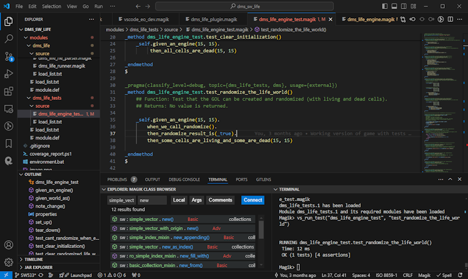

# Magik for Visual Studio Code

The [VS Code Magik extension](https://marketplace.visualstudio.com/items?itemName=ge-smallworld.magik-vscode) provides rich language support for the Magik programming language used in GE Vernova Smallworld GIS platform.

## Requirements

* Smallworld version 4 or 5
* Visual Studio Code 1.75 or newer (or editors compatible with VS Code 1.75+ APIs)

## Quick Start

Welcome to the world of Magik programming for Smallworld GIS!

Whether you are new to Magik or a long time veteran we you will find features of this extension that can improve your development experience.

Here is the quickest way to get started Programming Magik.

1. Install version [GE Vernova Smallworld](https://www.ge.com/digital/applications/smallworld-gis-geospatial-asset-management).
2. Install the [VS Code Magik extension](https://marketplace.visualstudio.com/items?itemName=ge-smallworld.magik-vscode).
3. Start a Smallworld session by typing `F2` then `z`.  
4. When the file picker opens, select the configuration directory containing the _gis_aliases_ file containing
the alias of the session.  
5. Then select the location of the _runalias.exe_ file that will be used to start the session.
6. Then chose the session alias that you want to run.
7. Once the session has started, type 'Alt + m` to initialize the integration procedures that will allow
you to easily compile and navigate you Magik source code.

For more on how to starting session and configuring your magik environment see the documentation
[here](./docs/getting_started.md).

## What's next

## Feature highlights

## Setting up your environment

## Contributing

## License
