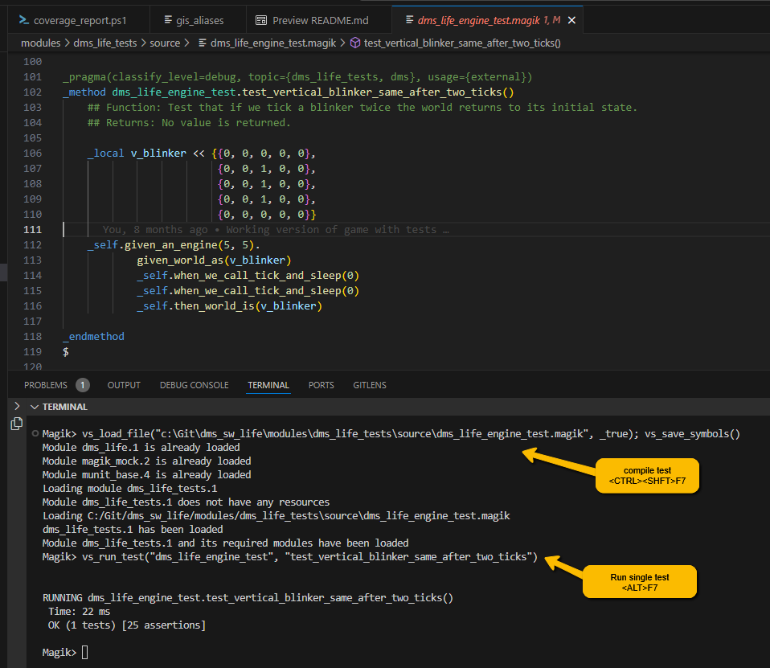

# Compiling Code and Running Tests

The following hotkeys can be to compile code and run tests in the Magik session.

 Hotkey | Description
--------|-------------
 `<CTRL>+<SHFT>+F7`   |Load the module and compile the code for the focused Magik file with editor focus.  In general, tests are not loaded when a Magik session starts so this is often a good way to force test modules to be loaded.  Test cases should have a dependency on MUnit, so it will also load MUnit.  The session in the focused terminal used is to compile the code if there are more than one session open.  Code compiled like this must be in the module load list to be compiled, so take care when adding new Magik code files and the products of dependant modules must be loaded.
 `<CTRL>+F7` | Compile the Magik code for the focused VS Code Magik editor.  This is standard way to compile or recompile a Magik file.  The session in the focused terminal is used to compile the code.  There ca be more than one session running in VS Code so the one with the terminal focus will be used for compiling code.
 `F8` | Compile selected Magik code.  Since there can be more than one session running in VS Code, the visible terminal (with the focus) will be used for compiling code.
 `<CTRL>+<ALT>+F7` | Run all the tests in the MUnit test case in the focused VS Code Magic editor.  The file must be a subclass of test_case or the command is ignored. The session in the focused terminal is used to run the test case.
 `<ALT>+F7` | Run a single test method in the MUnit test case in the focused VS Code Magik editor.  The test method where the edit cursor is placed determines the test to be run.  If the cursor is not in a test method (i.e. a method whose name starts with test_) or if the class is not a subclass of test_case, the request is ignored.  The session in the focused terminal is used to run the test case.  This is the fastest way to run a single test method.

 In a typical development session, while running tests it can be useful to open the `test_case` class file, then use the `<CTRL>+<SHFT>+F7` to load the dependencies of the test case (including `munit` if required), then to use `<CTRL>+<ALT>+F7` to run all tests in the class.  To run a single test method (using `<ALT>+F7`), the cursor and edit focus must be in the test method to be executed, otherwise the extension will not know which test should be run.  The results of running the tests are shown in the current Magik session terminal window.

 During editing it is always possible to re-compile the current Magik code file using the hotkey `<CTRL>+F7`.  This includes product or project source code as well as Magik files that are created using the command `Magic New Buffer` from the command palette.

Below is a screenshot showing a typical session where the code is first compiled (`<CTRL>+<SHFT>+F7`) then a single test is run (`<ALT>+F7`) with the edit cursor and focus on Line 111 in the Magik code file (recall the cursor should be in the test to execute when `<ALT>+F7` is used).

Note that the VS Code Magik extension will execute commands at the Magik prompt with procedures that have been loaded from the `vscode_dev.magik` script.  First, `vs_load_file()` is called to load and compile the test case (in this instance, while loading the dependencies) and then `vs_run_test()` is used to execute the test (this time specifying both the test case and the test method to run).

>Go back to [README](../README.md) for more on the Magik extension for VS Code
>
>Go to next topic [The Class Browser and Navigation](./navigation.md).
