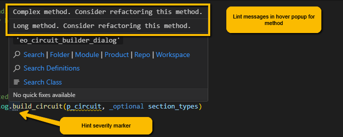

# Linting and Debugging

The VS Code extension for Magik comes with a set of lint rules that can be applied against Magik code files to point out potential problems with the code.  These rules are implemented and can be applied to a compiled Magik file using the hotkey `<CTRL>+<SHFT>+C` or selecting the command _Magik Check File_ from the command palette.  The results of the file check are shown in the _PROBLEMS_ tab in the bottom terminal area of VS Code.  Clicking on the line in the _Problems_ dialog will navigate to the problem in the editor window.  Also, _squiggly_ underscore are drawn below the program code that caused the problem.  The exact marker used in the edit window depends on the severity of the problem (Red for errors, Yellow for warnings and Blue for information).

Note, some issues, like _methods too long_ or _cyclomatic complexity warnings_ are reported at the _Hint_ severity.  These items are not reported in the problem window and the source members in the editor are shown with three small dots below the method name as shown in the screenshot below.  This level of reporting can make locating and addressing these issues difficult.

## Debugging

Magik source code can be debugged by attaching the a Java debugging agent to the session before it is started.  Using the debugger will adversely affect the performance of the application making it run very much more slowly.  The Magik debugger should be invoked using the following steps.

1. Compile the code to be debugged.
2. Start a Magik session that references the Smallworld _mda_ DLL file using the Java agent path argument.  It can be useful to create a special debugging alias that defines the java command line argument as part of the _SW_LAUNCH_JAVA_ARGS_ (see below).
3. When the session starts activate the VS Code Magik extension as usual with the `<CTRL>+<ALT>+M` hotkey.
4. Open Magik files and set break points.
5. With the Magik file as the current editing document, open the debug tab from the left side tool panels and click on _Run and Debug_.  The running Java threads should be visible in the call stack and the a panel with the declared break points should be available.
6. The application can then be used normally.  The code will stop on the break points and the local variables and slots can be inspected.
7. The _Debug Console_ dialog at the bottom of the application can be used to inspect and manipulate the application while it is running.  For example, when the application is stepping through a method, the \_self reference is valid and can be used in the same way that it would be used in code, but the state of \_self is as it is in the running application.
8. Stop debugging and stop the session.  Note that we have seen that the Magik debug remains active after the session has been stopped so it is a good idea to close Visual Studio Code and reopen it before starting another debug session.

Below is an example of an alias that provides the agent path argument to run a debug session.  This can also be put on the session command line with by adding an additional java argument like: 

> j -agentpath:S:\SW535\2025-01-17\core\bin\x86\mda.dll

where the _mda.dll_ is delivered with Smallworld.

Once the Magik session has attached to the debugger, the VS Code debug user interface works as expected, allowing the users to step over and into statements, as well as inspecting the state of variables during code execution.

Again we have observed that the Magik debug session is not necessarily closed cleanly when the editing session terminates, so it is wise to restart VS Code after the debugging session terminates.

> Go back to [README](../README.md) for more on the Magik extension for VS Code
