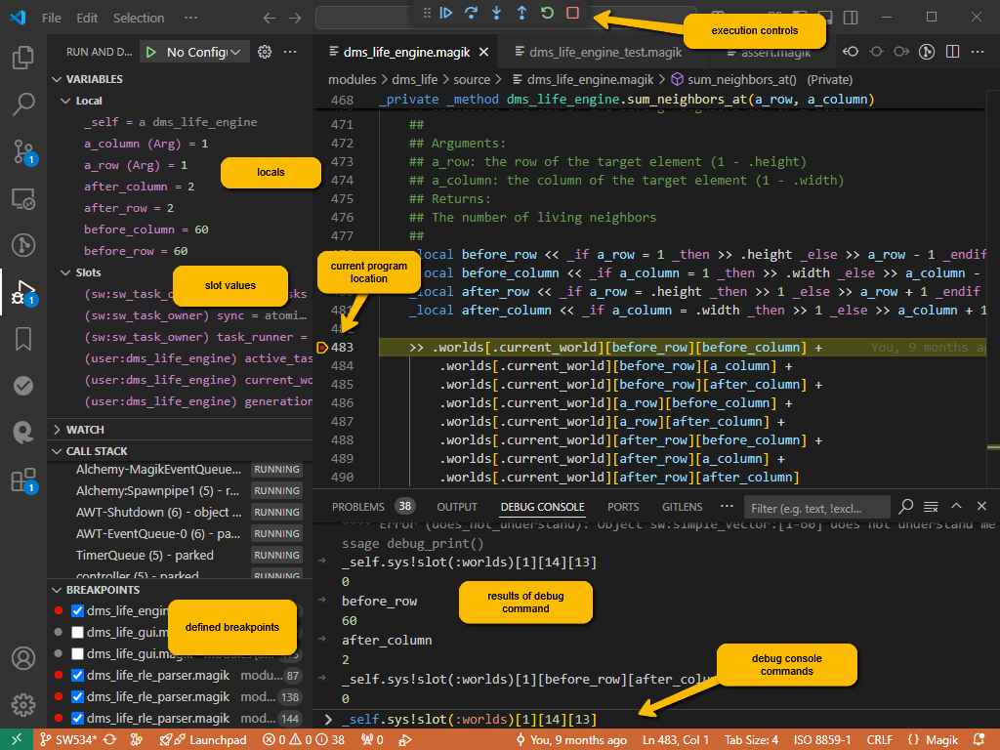

# Linting and Debugging

The VS Code extension for magik comes with a set of lint rules that can be applied against magik code files to point out potential problems with the code.  These rules are implemented and can be applied to a compiled magik file using the hotkey `<CTRL>+<SHFT>+t`.  The results of the file check are shown in the _PROBLEMS_ tab in the bottom terminal area of VS Code.  You can navigate to a problem by clicking on the line.  Also a yellow _squiggly_ underscore are drawn below the program code that caused the problem.

## Debugging

The magik debugger is still a work in progress and may exhibit unpredictable behaviour.  For best results, try using the following steps.

1. Compile the code to be debugged.  I think this is a Java debug agent that works with precompiled code.
2. Start a magik session that references the Smallworld _mda_ DLL file using the Java agent path argument.  It might be simple to create a
special debugging alias that defines the java command line argument as part of the SW_LAUNCH_JAVA_ARGS (see below).
3. When the session starts activate the VS Code magik extension using the `<ALT>+M` hotkey.
4. Open magik files and optionally set break points.
5. With the magik file as the current editing document, open the debug tab from the left side tool panels and click on _Run and Debug_.  You should see the threads in the call stack appear and you should see any break points.
6. Use your application normally.  The code should stop on the break points and allow you to inspect the state of the objects.
7. Stop debugging and stop the session.  Note that we have seen that the magik debug remains active after the session has been stopped so it is a good idea to close Visual Studio Code and reopen it before starting another debug session.

Below is an example of an alias that provides the agent path argument to run a debug session:

Once the magik session has attached to the debugger, the VS Code debug user interface works as expected, allowing the users to step over and into statements, as well as inspecting the state of variables during code execution.

Again we have observed that the magik debug session is not necessarily closed cleanly when the editing session terminates, so it is wise to restart VS Code after the debugging session terminates.

> Go back to [README](../README.md) for more on the Magik extension for VS Code
