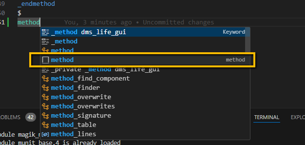

# Formatting and Editing

The VS Code extension for Magik provides the following hotkeys to help format and edit Magik code.

Hotkey | Description
--------|-------------
`<SHFT>+<ALT>+F` | Format current Magik code file.
`<ALT>+F` | Format the method (region) in the code file that contains the edit cursor.
`<CTRL>+<SHFT>+I` | Apply proper indenting to the code file containing the edit cursor.
`<CTRL>+I` | Apply proper indenting to the method (region) containing the edit cursor.
`<ALT>+<ENTER>` | Apply proper indenting from the start of the current method (region) to the line containing the edit cursor.

In addition to adjusting the indenting, formatting will manage the spaces between method names and the parenthesis and adjust the spacing around operators.

Document reformatting and changing the indenting may be undesired as they will be shown as changes in source code management tools like Git.

## Code Editing

VS Code provides a number of tools that can assist during code editing.  This includes syntax highlighting and code completion.
Code completion works by analysing the text being written and trying to make suggestions based on the current coding context as
shown in the screenshot below.  The user can navigate through the suggested completions using the `<Up Arrow>` and `<Down Arrow>` keys and
entering return to apply the suggestion.  Sometimes the suggests are not appropriate.  In this
case, use the `<ESC>` key to remove the code suggestions.  At any time typing `<CTRL>+<Space Bar>` will bring up a list of suggestions.

The VS Code Magik extension comes with a set of code _snippets_ that can help when writing repetitive code blocks.  Snippets are code templates that allow the user to include boilerplate code and complete it with interaction point defined in the template.  This allows user to create and used to have standard customizable code blocks.  The snippets are implemented as simple JSON files that allow them to be easily to extended, enhanced, or customized for a particular project or code style.  The code snippets that ship with the extension are found in the file:

> %userprofile%\.vscode\extensions\ge-smallworld.magik-vscode-0.2.3\snippets\magik.snippets.json

Where `userprofile` is the Windows environment variable representing the current users home directory (e.g.c:\users\\_name_). Each snippet has a _prefix_ attribute that represents the text that can be used to activate the snippet.  For example, there is a snippet for creating a new method with the prefix _method_.  Typing the prefix or in many cases a few letters of the prefix, then using `<CTRL>+<Space Bar>` to show the completion menu, will show the snippets associated with the text.  Snippet items are prefixed with a small square in the popup menu as shown below.

Once the snippet is activated, the template text is shown with the fields that can be completed, either with VS Code variables, dropdown choice items or free text.

It is possible to create custom snippets at the project (directory) or user (global) level by using the menu item _File >> Preferences >> Configure Snippets_.  Use the _scope_ attributes to indicate the language that the snippet applies to in multi-language snippet files.  For more information on creating and using snippets see [Snippets in Visual Studio code](https://code.visualstudio.com/docs/editor/userdefinedsnippets).

> Go back to [README](../README.md) for more on the Magik extension for VS Code
>
> Go to next topic [Linting and Debugging](./debugging.md).
