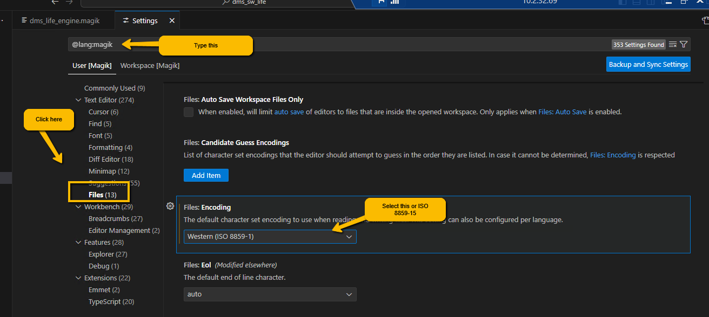

# Getting Started with Magik Sessions

Once you have installed the VS code extension for magik you should set the default character encodings for magik files.  If you are used to using files in different character sets it is important to know that VS Code with the Magik plugin does not respect the text encoding file header and so care must be taken when open files containing non-ascii characters.  VS Code will use UTF-8 as the default encoding, but I have had problems with this configuration for historic Magik projects.  It seems that ISO-8859-1 (Latin 1) is more often used and thus, I would recommend setting the default to ISO-8859-1, but care must be taken when working with other formats.  Saving a file in the wrong character encoding can damage the file making it difficult to recover (luckily these file are in generally in Git).  You can always see the encoding of the file in the information bar at the bottom of VS Code (see below).  Clicking on the encoding will allow you to save or open the file using a different encoding.  So, it is possible to reopen a file that was opened with an incorrect encoding by specifying the correct encoding.

You can easily configure the default encoding for Magik.  First open the settings page from the menu item at _File > Preferences > Settings_.  When the settings page opens, type the search string `@lang; magik` as shown in the screenshot below.  Then select the Files section and find the Encoding setting and set it to `ISO-8859-1` (or any other encoding that is appropriate for your work).  Note, message (msg) files are not covered by this setting and care must be taken when editing these types of files (especially as they have a tendency to use the more exotic encodings).

## Starting a Session

Historically, in Emacs, the key sequence `<F2>+Z` could be use to bring up the GIS console where we can execute the run alias command to start a session.  In VS Code `<F2>+Z`, will start a sequence of user interface dialogues that will assist the user in creating the runalias.exe command.  The first dialogue expects that the user to pick the directory containing an alias file.  Typically this will be in the config directory in the target product.  The dialogue acts as a directory picker and does not show the files contained in the directory, so you have to know where to stop.  This is generally where you see the magik_sessions directory.  When you are in the correct directory, click on the Search for aliases button to select the directory.

Next a dialogue opens where you are requested to find the _runalias.exe_ file.  This is the program that builds and launches the Java command to start the Smallworld session.  You are asked to select the file because if the environment variable `SMALLWORLD_GIS` is not defined, `runalias.exe` will define the variable relative to its location (it is in _core/bin/x86_ on Windows).

[Open Session - search runalias](./images/session_runalias.png)

Once you have selected the location of the _runalias.exe_ program, a drop down will appear from the VS Code search bar edit showing a list of aliases that can be started.

Selecting an alias from the list will cause the VS Code tool to create a command line and start the session in the current terminal.

In fact, this is not a very interesting way to start a session and, as in Emacs, it is just as easy to craft our own command line as the one that can be started with `<F2>+Z` are limited to use the specifying where Smallworld is installed and which alias file and alias to use.  We often want to use a custom environment file (using the -e command line argument).  In addition, the PowerShell history will allow you to re-run previous commands to start the session.  

For simple projects, we just have to specify the location of _runalias.exe_ then use the project `environment.bat` file and select the alias. For simple projects applications can be started with a command line like this:

> C:\swEO533\core\bin\x86\runalias.exe -e environment.bat -a .\config\gis_aliases dms_sw_life_open -cli

Projects will generally have their own strategy for starting sessions depending on the requirements, the sessions and the team that creates the startup scripts.

> Go back to [README](../README.md) for more on the Magik extension for VS Code

