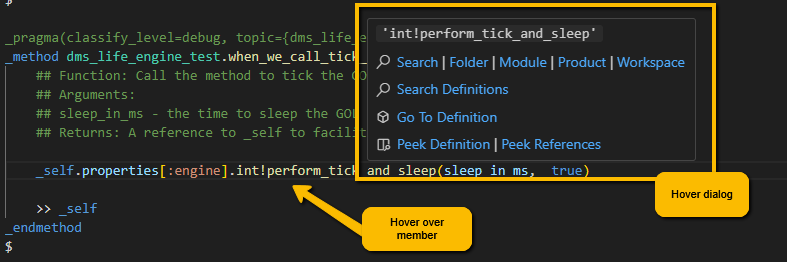
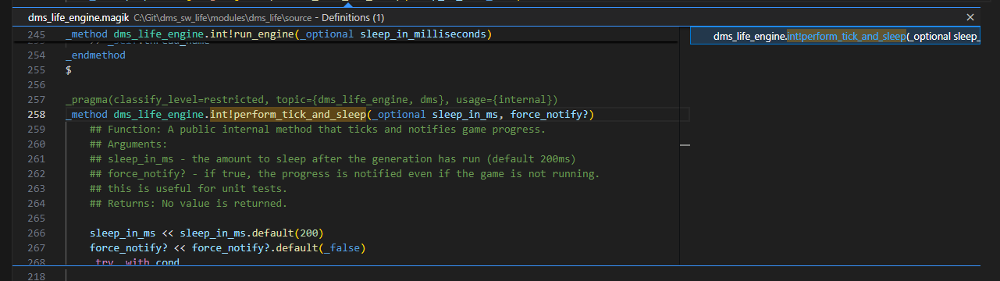
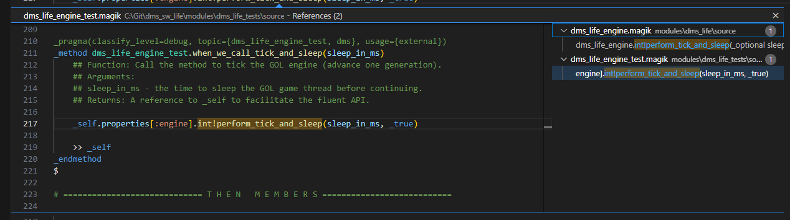
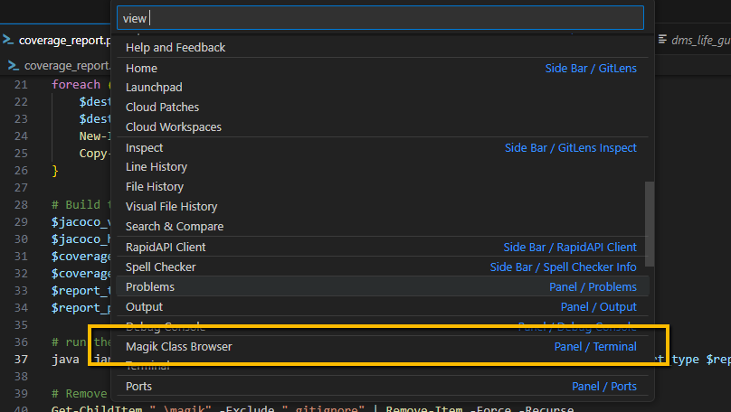
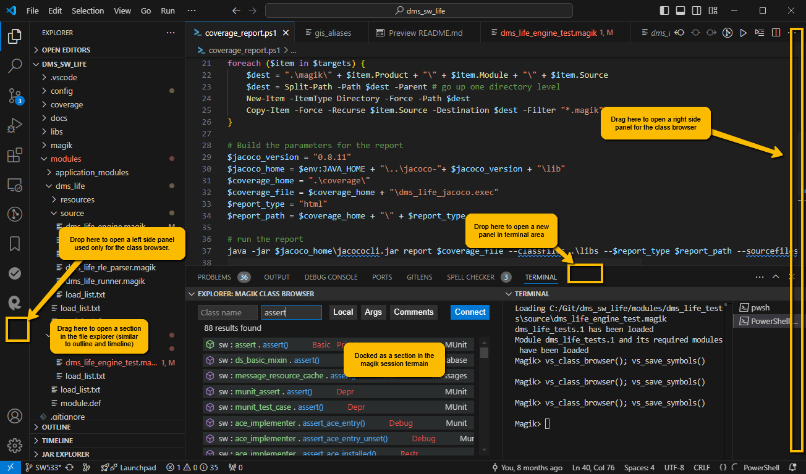
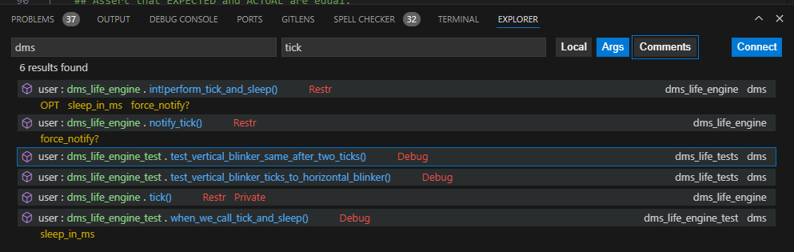
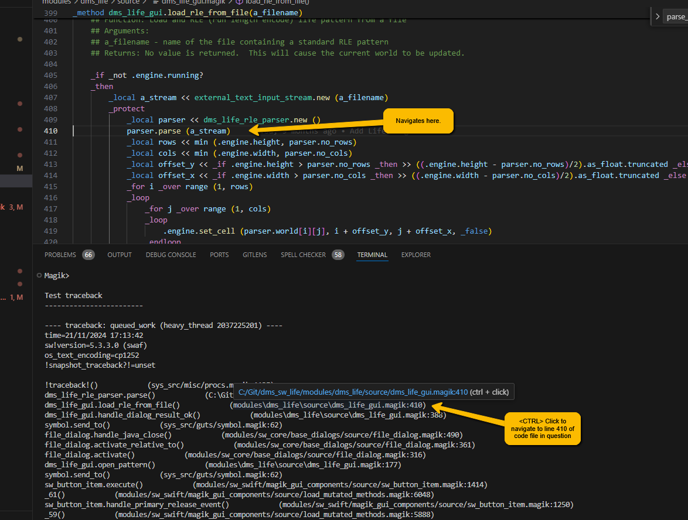

# The Class Browser and Code Navigation

The Magik Extension provides a number of tools for code navigation.  The table below summarizes the hotkeys used to activate the navigation tools and describes their use.
	
Hotkey | Description
--------|-------------
`F3` or `<ALT>+.` or `<ALT>+<Right Arrow>`| By placing the edit cursor on a method name and typing `F3`, `<ALT>+.` or `<ALT>+<Right Arrow> you can navigate to the definition of the method.  When we hover over the method, we can see the equivalent _goto_ item in the hover popup.
`<ALT>-<Left Arrow>` | Navigate to the previous location.
`<ALT>+[` or <ALT>+<Page Up>` | When navigating to a member with multiple candidates, this allows you to go to the previous definition.
`<ALT>+]` or `<ALT>+<Page Down>` | when navigationg to a member with multiple candidates, this allows you to go to the next definition.
`<CTRL>+b` | Open the class browser.  This will connect the class browser if it is not already connected.
`<CTRL>+<SHFT>+P` Magik Go To Clipboard | Copy the current clipboard text into the class browser.

Hovering over a method name will also bring up the navigation hover window.  When you hover over a member being used in a method the hover window gives the following popup window.

This provides the following functionality:

* Search - search for the target member in _Folder_, _Module_, _Product_ or VS Code _Workspace_.
* Search Definitions - copy the text to the class browser for searching via class browser.
* Go To Definition - navigate to the definition of the method under the cursor.
* Peek Definition or Peek References - open the _Peek_ popup and show the definition or the definition and references.

When we select the _references_ in the peek window, we see all the locations where the method is being used.

## The Class Browser

The Class Browser in VS Code provides a user interface dialogue that interacts with the magik _method finder_.  When the edit focus and cursor is in a magik file, the hotkey `<CTR>+b` will open the dialogue and connect it to the method finder.  You can open the class browser using the hotkey `<CTRL>+b` when the keyboard focus is in a magik code file or with the menu item _view >> Open View..._ (type ) 

The class browser in VS Code is a dialogue window that can be moved and in a number of areas allowing you to decide the most appropriate location based on your preferences and hardware.  The screenshot below shows some of the possibilities.

You can locate the class browser either in the terminal window or as a panel (as seen in the screenshot above).  This means the view can be moved to the right or left side of the application or docked in the terminal below.  In either case, it can be docked as either a new panel on the left or right or as a new section in a panel, or as a new tab in the terminal view at the bottom of the application or as a new section in an existing terminal tab.  The diagram below shows the possibilities.  You can not dock the class browser as an edit window nor outside the application frame as a floating window.

The class browser dialogue itself allows the user to type either class name or method name text to perform searches in the loaded class files.  The radio buttons allow user to filter the results, to show the argument names and to see the method documentation text as required.  Clicking on the method will open the method implementation in a magik text editor (if the source code can be located locally).  Additional information from the method pragmas are also displayed in the class browser method line.

## Traceback Navigation

Finally, when a traceback is raised during a running magik session, the traceback text in the session terminal can be used to navigate to the code associated with the traceback.  Simply click on a line of the traceback and you can navigate to the code file that is mentioned in the traceback (note, sometimes the terminal windows is not wide enough to keep the location information on one line and this may cause the code file search to fail).

> Go back to [README](../README.md) for more on the Magik extension for VS Code
